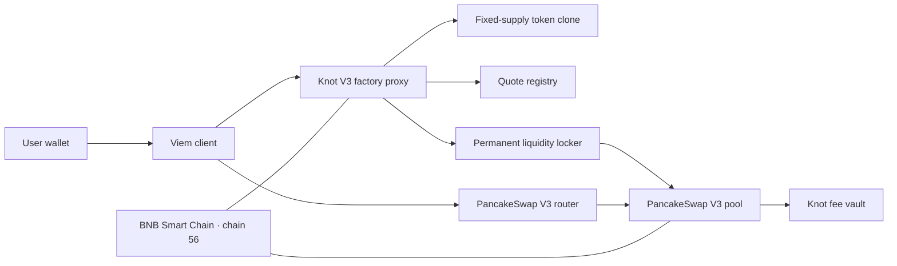

# BNB Chain architecture

## Launch path

`KnotV3Factory` is the user entry point. `launchContinuous` validates an enabled quote asset, deploys a deterministic token clone, registers its creator and quote, prepares the canonical PancakeSwap V3 pool, and permanently seeds the token-only position. An optional creator purchase is executed in the same transaction.

The factory is behind an OpenZeppelin transparent proxy. Its proxy admin is owned by `KnotV3UpgradeGate`, which enforces a two-day delay for scheduled factory implementation changes. The token, liquidity locker and fee vault deployed for this release are not proxies.

## Liquidity and trading

The launch supplies one billion tokens to a one-sided PancakeSwap V3 position at the edge of its range. Purchases add quote reserves; sells consume those reserves. The canonical Knot position is held by `KnotV3Liquidity`, which provides no NFT approval, transfer, principal-decrease or rescue function.

Users trade through standard PancakeSwap V3 contracts. Knot does not require a private relay or custodial wallet. Applications should simulate writes, use a nonzero minimum output, set a short deadline and verify chain ID 56 immediately before signing.

## Fees and rewards

Fees collected from Knot's original liquidity position enter `KnotV3FeeVault`. Forty percent is assigned to protocol revenue; sixty percent follows the creator's immutable launch allocation among holder dividends, token buybacks and creator cash. Third-party liquidity positions retain their own fees.

This repository documents the on-chain boundary only. Indexing, analytics, metadata hosting, automated distribution and other production services are intentionally outside its public scope.

